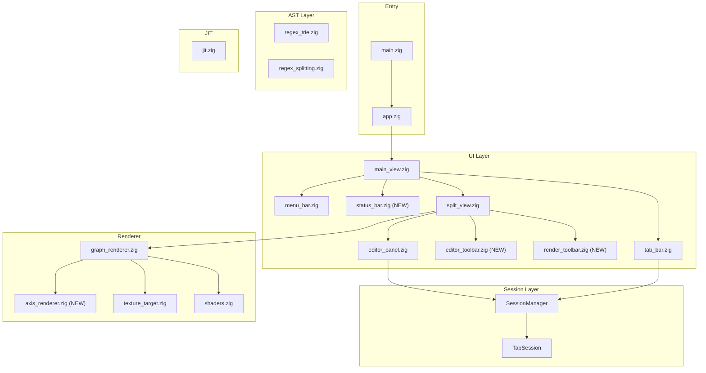
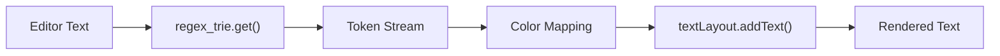
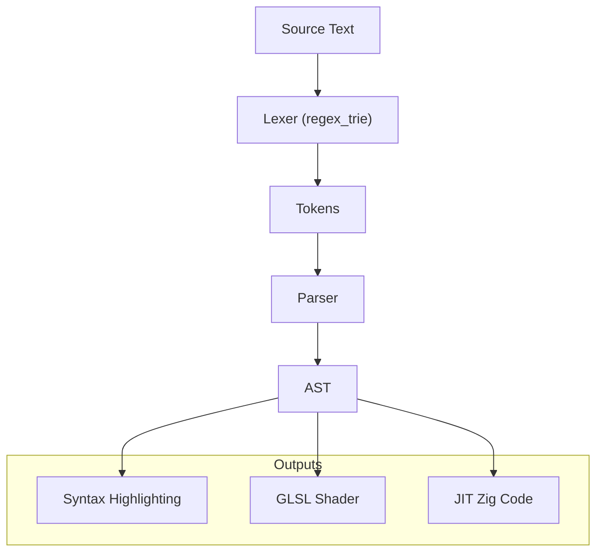

# Logos Code Architecture Evaluation and Implementation Plan

## Overview

Comprehensive evaluation of the Logos codebase structure for planned features: file management, scrollable tabs, syntax highlighting via manual tokenization, AST-based shader generation, and custom GPU rendering.

## Current Architecture

---

## Feature 1: File Path Per Tab

**Status**: Data model ready, UI changes needed

**Current**: [`TabSession`](src/session/tab_session.zig) already has `file_path: ?[]const u8`

**Changes needed**:

- Update [`SessionManager.createSession()`](src/session/session_manager.zig) to accept optional file path
- Add `loadFromFile()` and `saveToFile()` methods to TabSession
- Wire up File > Open/Save menu actions in [`main_view.zig`](src/ui/views/main_view.zig)

---

## Feature 2: Default File Path Near Executable

**Status**: Ready to implement

**Implementation**:

Create a utility function (in `app.zig` or a new `config.zig`) that retrieves the executable's directory path using Zig's standard library `std.fs.selfExePathAlloc()`, then joins it with a "documents" subdirectory. This provides a portable default save location relative to where the application is installed.

---

## Feature 3: File Explorer / Open Dialog

**Status**: SUPPORTED by dvui

**Implementation**:

dvui provides native file dialogs via TinyFileDialogs integration. The following functions are available:

- **Open single file**: `dvui.dialogNativeFileOpen()` - blocks and returns selected file path or null if cancelled
- **Open multiple files**: `dvui.dialogNativeFileOpenMultiple()` - returns array of selected paths
- **Save file**: `dvui.dialogNativeFileSave()` - blocks and returns chosen save path
- **Select folder**: `dvui.dialogNativeFolderSelect()` - returns selected folder path

All functions accept options for title, starting path, and file filters. Implementation in [`main_view.zig`](src/ui/views/main_view.zig) will call these blocking functions when File menu actions (Open, Save, Save As) are triggered.

---

## Feature 4: Tab Tooltip (Full Path on Hover)

**Status**: Ready - dvui supports tooltips

**Implementation**:

In [`tab_bar.zig`](src/ui/components/tab_bar.zig), after rendering each tab, check if the session has a file path. If so, use `dvui.tooltip()` to display the full file path when the user hovers over the tab. This provides access to full path information without cluttering the tab UI.

---

## Feature 5: Status Bar (Bottom of Window)

**Status**: Ready to implement

**Implementation**:

Create a new component [`status_bar.zig`](src/ui/components/status_bar.zig) that renders a horizontal bar at the bottom of the main view. The status bar will display:

- **Left side**: Current file path of the active tab (or "Untitled" if unsaved)
- **Right side**: Line count and current cursor position (e.g., "142 lines | Ln 42, Col 15")

The status bar should have a subtle background color matching the application theme and use a smaller font size. It needs to receive the active session from the session manager to access file path, content line count, and cursor position from the text entry widget.

Integrate the status bar into [`main_view.zig`](src/ui/views/main_view.zig) as the last element in the main vertical layout.

---

## Feature 6: Scrollable Tab Bar with Visual Indicators

**Status**: Ready to implement with custom enhancements

**Implementation**:

Modify [`tab_bar.zig`](src/ui/components/tab_bar.zig) to handle tab overflow:

1. **Scroll container**: Wrap the tabs row in a horizontal `dvui.scrollArea()` with vertical scrolling disabled and horizontal scrollbar hidden

2. **Fade effect**: When tabs extend beyond visible area, render a gradient fade overlay on the edge(s) where more content exists. This is achieved by drawing semi-transparent rectangles that fade from opaque (matching background) to transparent

3. **Arrow indicators**: Display small triangle arrow buttons on the left and/or right edges when scrolling is possible in that direction. Clicking an arrow scrolls the tab bar by one tab width. Arrows should only be visible when there are tabs in that direction to scroll to

4. **State tracking**: Track scroll position to determine which indicators to show

---

## Feature 7: Syntax Highlighting (Manual Tokenization with regex_trie)

**Status**: FULLY SUPPORTED by dvui

### Architecture

### Implementation Steps

**Step 1: Extend RegexTrieValue with token types**

Add a `TokenType` enum to [`regex_trie.zig`](src/ast/regex_trie.zig) containing categories like keyword, identifier, number, operator, string, comment, punctuation, and unknown. Include this token type as a field in the RegexTrieValue struct so each regex pattern is associated with its syntactic category.

**Step 2: Define syntax color palette**

In [`theme.zig`](src/ui/theme.zig), create a syntax_colors namespace with dvui.Color constants for each token type. Use a cohesive color scheme (e.g., purple for keywords, green for strings, orange for numbers, gray for comments).

**Step 3: Create lexer module**

Create a new file `src/ast/lexer.zig` containing a Lexer struct that wraps a RegexTrie. The lexer provides a `tokenize()` method that returns a TokenIterator. The iterator's `next()` method advances through the input text, using `trie.get()` to match the longest token at the current position, returning Token structs containing the matched text, token type, and byte offsets.

**Step 4: Integrate with editor panel**

Modify [`editor_panel.zig`](src/ui/components/editor_panel.zig) to use manual text rendering instead of default textEntry drawing. After calling `processEvents()` and `drawBeforeText()` on the text entry, tokenize the content with the lexer. For each token, call `textEntry.textLayout.addText()` with the token text and appropriate color from the theme's syntax_colors based on token type. Finish with `addTextDone()` and `drawAfterText()`.

**Performance note**: Enable `cache_layout: true` in textEntry init options - dvui will only re-render visible and changed regions.

---

## Feature 8: Custom SDL3 GPU Code for Render Area

**Status**: Good foundation in [`texture_target.zig`](src/renderer/texture_target.zig)

### Implementation Path

**Step 1: Access SDL3 GPU device**

In [`graph_renderer.zig`](src/renderer/graph_renderer.zig), import the SDL backend from dvui. Create a method that accepts shader source code and uses the SDL3 GPU API to compile shaders, create render pipelines, and render to the texture target.

**Step 2: Shader compilation pipeline**

For shader compilation, choose one of these approaches:
- Pre-compile GLSL to SPIR-V at build time using glslc or shaderc
- Use runtime compilation via the shaderc library
- Use SDL3's built-in shader format which accepts SPIR-V or platform-specific bytecode

The compiled shader is then used to create an SDL_GPUShader and associated pipeline for rendering.

---

## Feature 9: AST Integration (Shared for Highlighting + Shader Gen)

### Data Flow

### AST Node Types

Create a new file `src/ast/ast_nodes.zig` defining an AstNode tagged union. Node types include:

- **Literals**: number (f64), identifier (string slice)
- **Expressions**: binary_op (operator enum + left/right children), unary_op, function_call (name + args slice)
- **Statements**: binding (name-value pair), if_expr, while_loop, for_loop
- **Compound**: tuple (array of nodes), block (array of statements)

Each compound node type contains the necessary fields (operator enums, child pointers, string slices for names).

### Parser

Create `src/ast/parser.zig` with a Parser struct that takes a token slice and allocator. Implement recursive descent parsing with methods like `parse()`, `parseExpression()`, `parseBinding()`, `parseFunctionCall()` that construct and return AstNode pointers.

---

## Feature 10: GLSL Code Generation

Create a new file `src/ast/codegen/glsl.zig` containing a GlslGenerator struct. The generator maintains an output buffer (ArrayList of u8) and a list of discovered uniforms.

The `generate()` method walks the AST and emits GLSL code:
1. Emit version header and uniform declarations
2. Emit main function opening
3. Recursively emit each AST node as GLSL expressions/statements
4. Emit closing brace

The `emitNode()` method switches on node type: numbers emit as literals, identifiers as variable names, binary ops emit parenthesized infix expressions with the appropriate GLSL operator, function calls emit as GLSL function syntax.

---

## Feature 11: Parsing Error Display

**Status**: SUPPORTED by dvui

**Implementation**:

When the parser encounters an error, store the error information (byte offset range, error message) in the TabSession.

In the editor panel's syntax highlighting pass, check if any token falls within an error range. For tokens in error regions:

1. Use `addText()` with a red `color_text` to highlight the erroneous text
2. Use `addTextTooltip()` instead of regular `addText()` to make the error region hoverable, displaying the error message when the user hovers over it

This provides inline error feedback similar to modern code editors.

---

## Feature 12: Coordinate Axes in Render Area

**Status**: Custom implementation needed

**Implementation**:

Create axis rendering functionality in [`graph_renderer.zig`](src/renderer/graph_renderer.zig) or a new `axis_renderer.zig`:

**Axis layout**:
- Axis 1 (X-axis): Horizontal bar at the bottom of the render area
- Axis 2 (Y-axis): Vertical bar on the left side of the render area
- The actual plot/graph area occupies the remaining space (top-right region)

**Axis features**:
- Display numbered tick marks at regular intervals
- Draw light grid lines extending from each tick mark into the plot area
- Numbers positioned outside the plot area along each axis

**Interaction**:
- **Zoom**: Mouse wheel in the plot area scales both axes relative to the center point. Zooming increases or decreases the visible range symmetrically around the current center
- **Pan**: Click and drag in the plot area (not on the axes themselves) moves the view, updating axis ranges accordingly
- Axes dynamically update their tick marks and numbers during zoom/pan to maintain readable intervals

Reference dvui's `PlotWidget.Axis` for tick calculation and formatting logic. Reference the `scroll_canvas.zig` example for implementing zoom/pan with coordinate transforms.

---

## Feature 13: Editor Toolbar

**Status**: New component needed

**Implementation**:

Create [`editor_toolbar.zig`](src/ui/components/editor_toolbar.zig) - a horizontal toolbar rendered above the text editor area.

**Contents**:
- **Play button**: Triggers evaluation/rendering of the current expression
- **Pause button**: Stops ongoing animation or continuous evaluation
- **Additional suggested buttons**: Stop (reset to initial state), Step (evaluate one step)
- **Collapse button** (right-aligned): Toggles toolbar visibility

**Collapse behavior**:
When collapsed, the entire toolbar shrinks to a single small square button positioned at the top-right corner of the editor area. The text area and line number gutter expand upward to fill the freed space. Clicking the collapsed button restores the full toolbar.

---

## Feature 14: Render Area Toolbar

**Status**: New component needed

**Implementation**:

Create [`render_toolbar.zig`](src/ui/components/render_toolbar.zig) - a horizontal toolbar rendered above the graph/render area.

**Contents**:
- **2D/3D toggle button**: Switches between 2D function plotting (y = f(x)) and 3D surface/volume visualization
- **Additional buttons as needed**: Export image, reset view, toggle grid
- **Collapse button** (right-aligned): Toggles toolbar visibility

**Collapse behavior**:
When collapsed, the toolbar shrinks to a single small square button at the top-right corner of the render area. The graph area expands upward, and Axis 2 (Y-axis) extends slightly higher to fill the space. Clicking the collapsed button restores the full toolbar.

---

## Feature 15: Math Symbol Positioning

**Status**: NOT SUPPORTED by dvui - DEFERRED

dvui's TextLayoutWidget is fundamentally line-based with sequential character flow. It does not support:
- Vertical stacking of expressions (e.g., fractions with numerator over denominator)
- Superscript and subscript positioning
- Custom 2D symbol placement for mathematical notation (integrals, summations, matrices)

**This feature is deferred for future implementation.** Implementing proper mathematical typesetting would require building a custom math layout rendering engine using dvui's lower-level Path drawing primitives to manually position each symbol, or integrating a specialized math rendering library.

---

## Integration: TabSession with AST

Update [`TabSession`](src/session/tab_session.zig) to include:

- **ast field**: Optional pointer to the parsed AstNode tree (replaces placeholder ParsedData)
- **generated_glsl field**: Optional slice containing generated shader code
- **parse_errors field**: List of error positions and messages for error highlighting

Add methods:
- **parseContent()**: Tokenizes content using the lexer, then parses tokens into AST, storing any errors
- **generateShader()**: If AST exists, runs GLSL generator and stores result

---

## Summary Table

| Feature | Status | Files to Change | Effort |
|---------|--------|-----------------|--------|
| File path per tab | Ready | tab_session.zig, session_manager.zig, main_view.zig | Low |
| Default exe path | Ready | New config.zig or app.zig | Low |
| File dialog | Supported | main_view.zig | Low |
| Tab tooltip | Ready | tab_bar.zig | Low |
| Status bar | Ready | New status_bar.zig, main_view.zig | Low |
| Scrollable tabs | Ready | tab_bar.zig | Medium |
| Syntax highlighting | Ready | New lexer.zig, editor_panel.zig, theme.zig | Medium |
| Custom GPU render | Foundation | graph_renderer.zig, shaders.zig | Medium |
| AST pipeline | Foundation | New ast_nodes.zig, parser.zig | High |
| GLSL codegen | Not started | New codegen/glsl.zig | High |
| Parsing error display | Supported | editor_panel.zig, tab_session.zig | Medium |
| Coordinate axes | Foundation | graph_renderer.zig or new axis_renderer.zig | Medium |
| Editor toolbar | Not started | New editor_toolbar.zig, split_view.zig | Medium |
| Render toolbar | Not started | New render_toolbar.zig, split_view.zig | Medium |
| Math symbol positioning | Not supported | Deferred | High |

---

## Recommended Implementation Order

1. **File management** (Features 1-3) - Foundation for everything else
2. **Tab improvements** (Features 4, 6) - Quick wins, improve UX
3. **Status bar** (Feature 5) - Standard editor UI element
4. **Toolbars** (Features 13-14) - UI infrastructure for controls
5. **Lexer + Syntax highlighting** (Feature 7) - Core editing experience
6. **Coordinate axes** (Feature 12) - Essential for math visualization
7. **Parsing error display** (Feature 11) - Better developer experience
8. **AST parser** (Feature 9) - Needed for shader gen
9. **GLSL codegen** (Feature 10) - The main goal
10. **Custom GPU rendering** (Feature 8) - Display generated shaders

**Conclusion**: The codebase structure is **excellent** for all planned features. The separation between UI, session, AST, and renderer layers is clean. The regex_trie foundation is solid for tokenization. dvui's manual `addText()` API makes syntax highlighting straightforward. Native file dialogs are available. Math symbol positioning requires future custom work.
