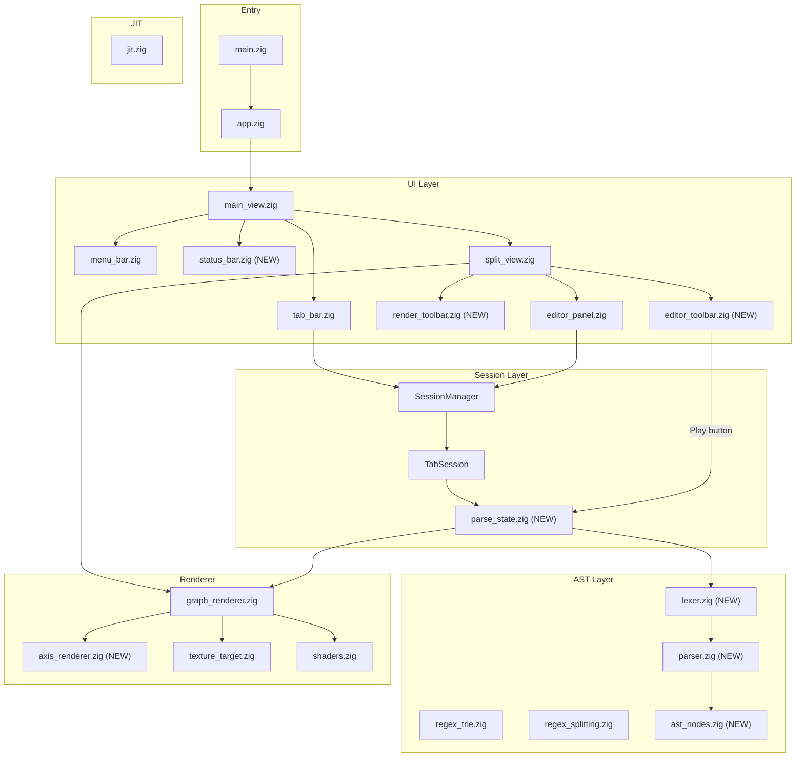
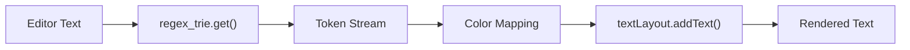
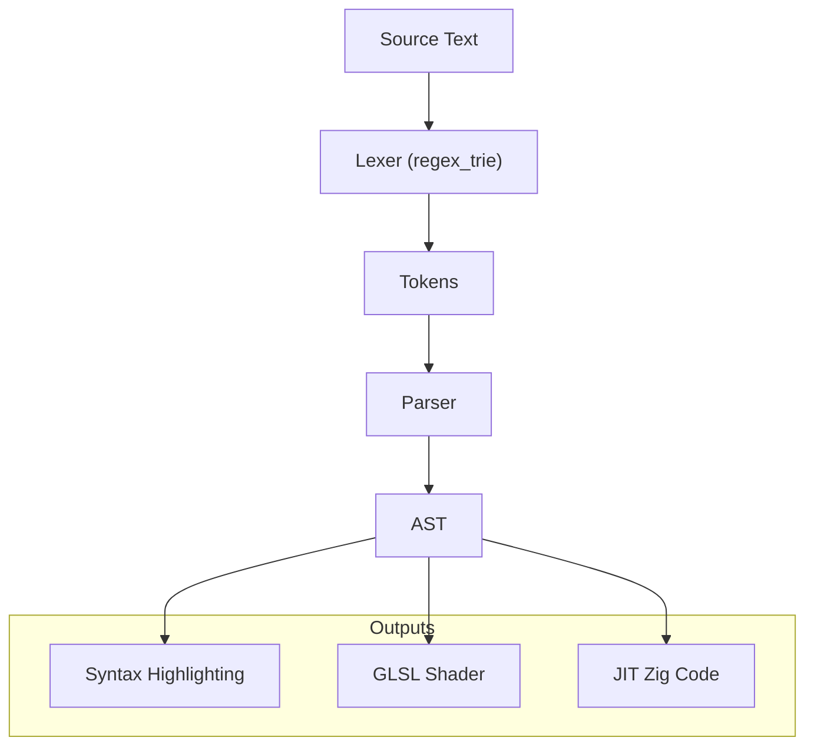
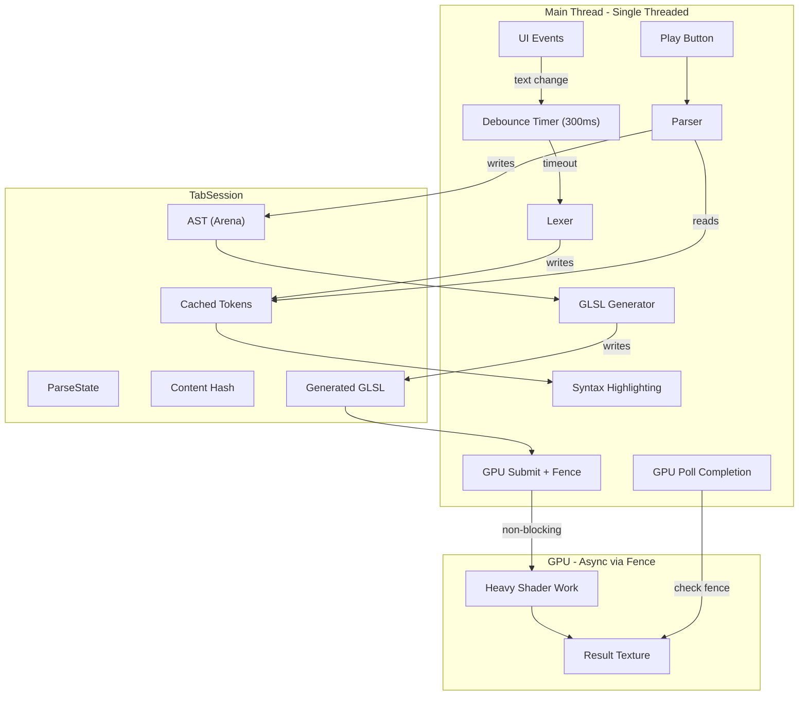
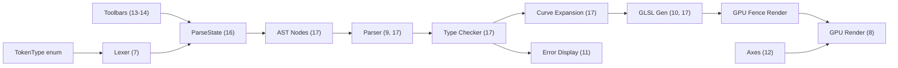
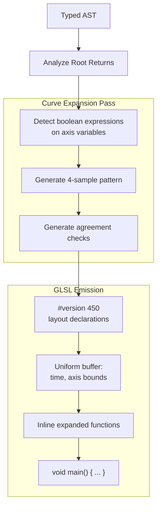

# Logos Code Architecture Evaluation and Implementation Plan

## Overview

Comprehensive evaluation of the Logos codebase structure for planned features: file management, scrollable tabs, syntax highlighting via manual tokenization, AST-based shader generation, and custom GPU rendering.

## Current Architecture



---

## Feature 1: File Path Per Tab

**Status**: Data model ready, UI changes needed

**Current**: [`TabSession`](src/session/tab_session.zig) already has `file_path: ?[]const u8`

**Changes needed**:

- Update [`SessionManager.createSession()`](src/session/session_manager.zig) to accept optional file path
- Add `loadFromFile()` and `saveToFile()` methods to TabSession
- Wire up File > Open/Save menu actions in [`main_view.zig`](src/ui/views/main_view.zig)

---

## Feature 2: Default File Path Near Executable

**Status**: Ready to implement

**Implementation**:

Create a utility function (in `app.zig` or a new `config.zig`) that retrieves the executable's directory path using Zig's standard library `std.fs.selfExePathAlloc()`, then joins it with a "documents" subdirectory. This provides a portable default save location relative to where the application is installed.

---

## Feature 3: File Explorer / Open Dialog

**Status**: SUPPORTED by dvui

**Implementation**:

dvui provides native file dialogs via TinyFileDialogs integration. The following functions are available:

- **Open single file**: `dvui.dialogNativeFileOpen()` - blocks and returns selected file path or null if cancelled
- **Open multiple files**: `dvui.dialogNativeFileOpenMultiple()` - returns array of selected paths
- **Save file**: `dvui.dialogNativeFileSave()` - blocks and returns chosen save path
- **Select folder**: `dvui.dialogNativeFolderSelect()` - returns selected folder path

All functions accept options for title, starting path, and file filters. Implementation in [`main_view.zig`](src/ui/views/main_view.zig) will call these blocking functions when File menu actions (Open, Save, Save As) are triggered.

---

## Feature 4: Tab Tooltip (Full Path on Hover)

**Status**: Ready - dvui supports tooltips

**Implementation**:

In [`tab_bar.zig`](src/ui/components/tab_bar.zig), after rendering each tab, check if the session has a file path. If so, use `dvui.tooltip()` to display the full file path when the user hovers over the tab. This provides access to full path information without cluttering the tab UI.

---

## Feature 5: Status Bar (Bottom of Window)

**Status**: Ready to implement

**Implementation**:

Create a new component [`status_bar.zig`](src/ui/components/status_bar.zig) that renders a horizontal bar at the bottom of the main view. The status bar will display:

- **Left side**: Current file path of the active tab (or "Untitled" if unsaved)
- **Right side**: Line count and current cursor position (e.g., "142 lines | Ln 42, Col 15")

The status bar should have a subtle background color matching the application theme and use a smaller font size. It needs to receive the active session from the session manager to access file path, content line count, and cursor position from the text entry widget.

Integrate the status bar into [`main_view.zig`](src/ui/views/main_view.zig) as the last element in the main vertical layout.

---

## Feature 6: Scrollable Tab Bar with Visual Indicators

**Status**: Ready to implement with custom enhancements

**Implementation**:

Modify [`tab_bar.zig`](src/ui/components/tab_bar.zig) to handle tab overflow:

1. **Scroll container**: Wrap the tabs row in a horizontal `dvui.scrollArea()` with vertical scrolling disabled and horizontal scrollbar hidden

2. **Fade effect**: When tabs extend beyond visible area, render a gradient fade overlay on the edge(s) where more content exists. This is achieved by drawing semi-transparent rectangles that fade from opaque (matching background) to transparent

3. **Arrow indicators**: Display small triangle arrow buttons on the left and/or right edges when scrolling is possible in that direction. Clicking an arrow scrolls the tab bar by one tab width. Arrows should only be visible when there are tabs in that direction to scroll to

4. **State tracking**: Track scroll position to determine which indicators to show

---

## Feature 7: Syntax Highlighting (Manual Tokenization with regex_trie)

**Status**: FULLY SUPPORTED by dvui

### Architecture



### Implementation Steps

**Step 1: Extend RegexTrieValue with token types**

Add a `TokenType` enum to [`regex_trie.zig`](src/ast/regex_trie.zig) containing categories like keyword, identifier, number, operator, string, comment, punctuation, and unknown. Include this token type as a field in the RegexTrieValue struct so each regex pattern is associated with its syntactic category.

**Step 2: Define syntax color palette**

In [`theme.zig`](src/ui/theme.zig), create a syntax_colors namespace with dvui.Color constants for each token type. Use a cohesive color scheme (e.g., purple for keywords, green for strings, orange for numbers, gray for comments).

**Step 3: Create lexer module**

Create a new file `src/ast/lexer.zig` containing a Lexer struct that wraps a RegexTrie. The lexer provides a `tokenize()` method that returns a TokenIterator. The iterator's `next()` method advances through the input text, using `trie.get()` to match the longest token at the current position, returning Token structs containing the matched text, token type, and byte offsets.

**Step 4: Integrate with editor panel**

Modify [`editor_panel.zig`](src/ui/components/editor_panel.zig) to use manual text rendering instead of default textEntry drawing. After calling `processEvents()` and `drawBeforeText()` on the text entry, tokenize the content with the lexer. For each token, call `textEntry.textLayout.addText()` with the token text and appropriate color from the theme's syntax_colors based on token type. Finish with `addTextDone()` and `drawAfterText()`.

**Performance note**: Enable `cache_layout: true` in textEntry init options - dvui will only re-render visible and changed regions.

---

## Feature 8: Custom SDL3 GPU Code for Render Area

**Status**: Good foundation in [`texture_target.zig`](src/renderer/texture_target.zig)

### Implementation Path

**Step 1: Access SDL3 GPU device**

In [`graph_renderer.zig`](src/renderer/graph_renderer.zig), import the SDL backend from dvui. Create a method that accepts shader source code and uses the SDL3 GPU API to compile shaders, create render pipelines, and render to the texture target.

**Step 2: Shader compilation pipeline**

For shader compilation, choose one of these approaches:
- Pre-compile GLSL to SPIR-V at build time using glslc or shaderc
- Use runtime compilation via the shaderc library
- Use SDL3's built-in shader format which accepts SPIR-V or platform-specific bytecode

The compiled shader is then used to create an SDL_GPUShader and associated pipeline for rendering.

---

## Feature 9: AST Integration (Shared for Highlighting + Shader Gen)

### Data Flow



### AST Node Types

Create a new file `src/ast/ast_nodes.zig` defining an AstNode tagged union. Node types include:

- **Literals**: number (f64), identifier (string slice)
- **Expressions**: binary_op (operator enum + left/right children), unary_op, function_call (name + args slice)
- **Statements**: binding (name-value pair), if_expr, while_loop, for_loop
- **Compound**: tuple (array of nodes), block (array of statements)

Each compound node type contains the necessary fields (operator enums, child pointers, string slices for names).

### Parser

Create `src/ast/parser.zig` with a Parser struct that takes a token slice and allocator. Implement recursive descent parsing with methods like `parse()`, `parseExpression()`, `parseBinding()`, `parseFunctionCall()` that construct and return AstNode pointers.

---

## Feature 10: GLSL Code Generation

Create a new file `src/ast/codegen/glsl.zig` containing a GlslGenerator struct. The generator maintains an output buffer (ArrayList of u8) and a list of discovered uniforms.

The `generate()` method walks the AST and emits GLSL code:
1. Emit version header and uniform declarations
2. Emit main function opening
3. Recursively emit each AST node as GLSL expressions/statements
4. Emit closing brace

The `emitNode()` method switches on node type: numbers emit as literals, identifiers as variable names, binary ops emit parenthesized infix expressions with the appropriate GLSL operator, function calls emit as GLSL function syntax.

---

## Feature 11: Parsing Error Display

**Status**: SUPPORTED by dvui

**Implementation**:

When the parser encounters an error, store the error information (byte offset range, error message) in the TabSession.

In the editor panel's syntax highlighting pass, check if any token falls within an error range. For tokens in error regions:

1. Use `addText()` with a red `color_text` to highlight the erroneous text
2. Use `addTextTooltip()` instead of regular `addText()` to make the error region hoverable, displaying the error message when the user hovers over it

This provides inline error feedback similar to modern code editors.

---

## Feature 12: Coordinate Axes in Render Area

**Status**: Custom implementation needed

**Implementation**:

Create axis rendering functionality in [`graph_renderer.zig`](src/renderer/graph_renderer.zig) or a new `axis_renderer.zig`:

**Axis layout**:
- Axis 1 (X-axis): Horizontal bar at the bottom of the render area
- Axis 2 (Y-axis): Vertical bar on the left side of the render area
- The actual plot/graph area occupies the remaining space (top-right region)

**Axis features**:
- Display numbered tick marks at regular intervals
- Draw light grid lines extending from each tick mark into the plot area
- Numbers positioned outside the plot area along each axis

**Interaction**:
- **Zoom**: Mouse wheel in the plot area scales both axes relative to the center point. Zooming increases or decreases the visible range symmetrically around the current center
- **Pan**: Click and drag in the plot area (not on the axes themselves) moves the view, updating axis ranges accordingly
- Axes dynamically update their tick marks and numbers during zoom/pan to maintain readable intervals

Reference dvui's `PlotWidget.Axis` for tick calculation and formatting logic. Reference the `scroll_canvas.zig` example for implementing zoom/pan with coordinate transforms.

---

## Feature 13: Editor Toolbar

**Status**: Done

**Implementation**:

Create [`editor_toolbar.zig`](src/ui/components/editor_toolbar.zig) - a horizontal toolbar rendered above the text editor area.

**Contents**:
- **Play button**: Triggers evaluation/rendering of the current expression
- **Pause button**: Stops ongoing animation or continuous evaluation
- **Additional suggested buttons**: Stop (reset to initial state), Step (evaluate one step)

---

## Feature 14: Render Area Toolbar

**Status**: New component needed

**Implementation**:

Create [`render_toolbar.zig`](src/ui/components/render_toolbar.zig) - a horizontal toolbar rendered above the graph/render area.

**Contents**:
- **2D/3D toggle button**: Switches between 2D function plotting (y = f(x)) and 3D surface/volume visualization
- **Additional buttons as needed**: Export image, reset view, toggle grid
- **Collapse button** (right-aligned): Toggles toolbar visibility

**Collapse behavior**:
When collapsed, the toolbar shrinks to a single small square button at the top-right corner of the render area. The graph area expands upward, and Axis 2 (Y-axis) extends slightly higher to fill the space. Clicking the collapsed button restores the full toolbar.

---

## Feature 15: Math Symbol Positioning

**Status**: NOT SUPPORTED by dvui - DEFERRED

dvui's TextLayoutWidget is fundamentally line-based with sequential character flow. It does not support:
- Vertical stacking of expressions (e.g., fractions with numerator over denominator)
- Superscript and subscript positioning
- Custom 2D symbol placement for mathematical notation (integrals, summations, matrices)

**This feature is deferred for future implementation.** Implementing proper mathematical typesetting would require building a custom math layout rendering engine using dvui's lower-level Path drawing primitives to manually position each symbol, or integrating a specialized math rendering library.

---

## Feature 16: Per-Tab Parsing System Architecture

**Status**: Design finalized, implementation pending

This feature defines the complete architecture for parsing user input in each tab, including lexing for syntax highlighting and full AST parsing for shader generation.

### Architecture Overview



### Design Decisions

#### 1. Trigger Mechanism: Debounced Lexing

- **Lexing**: Triggered after 300ms of no input (debounced)
- **Parsing + GLSL generation**: Triggered only when user clicks Play button
- **Rationale**: Provides immediate syntax highlighting feedback while deferring expensive AST construction until explicitly requested

#### 2. State Location: Separate ParseState Struct

Create a `ParseState` struct that encapsulates all parsing-related state, owned by `TabSession`:

```zig
pub const ParseState = struct {
    /// Hash of content when last lexed (for cache invalidation)
    content_hash: u64,
    
    /// Cached token stream from lexer
    tokens: ?[]Token,
    
    /// Parsed AST (allocated in parse_arena)
    ast: ?*AstNode,
    
    /// Generated GLSL shader code
    generated_glsl: ?[]const u8,
    
    /// Parse errors for display
    errors: std.ArrayList(ParseError),
    
    /// Arena allocator for this parse cycle
    parse_arena: std.heap.ArenaAllocator,
    
    /// Parsing status
    status: enum { idle, lexing, parsing, ready, error },
};
```

#### 3. Lexer/Parser Separation

- **Lexer** runs on main thread during debounce timeout → produces tokens for syntax highlighting
- **Parser** runs on main thread when Play is clicked → produces AST from tokens
- **Rationale**: Keeps architecture simple; parsing math expressions is typically fast

#### 4. Single-Threaded Architecture

**Design Choice**: All parsing and GLSL generation happens on the main thread.

**Why single-threaded**:
- Simpler implementation, no synchronization complexity
- Math expressions are typically short (parsing is fast)
- Heavy computation is offloaded to GPU via async fence-based rendering
- Easier to debug and reason about

**Main loop flow when Play is clicked**:
1. Parse tokens → AST (fast, on main thread)
2. Generate GLSL from AST (fast, on main thread)
3. Compile shader (GPU, may have small sync cost)
4. Submit render work with fence (returns immediately)
5. Continue UI loop, poll fence each frame

#### Non-Blocking GPU Rendering with Fences

SDL3 GPU provides fence synchronization for async rendering. The main thread submits GPU work and continues immediately without waiting:

```zig
pub const AsyncRenderState = struct {
    pending_fence: ?*sdl.GPU_Fence = null,
    result_texture: *sdl.GPU_Texture,
    iteration: usize = 0,
    
    /// Submit render work to GPU, returns immediately
    pub fn submitIteration(self: *AsyncRenderState, device: *sdl.GPU_Device, cmd: *sdl.GPU_CommandBuffer) void {
        // Submit and get fence - returns immediately!
        self.pending_fence = sdl.submitGPUCommandBufferAndAcquireFence(cmd);
        self.iteration += 1;
    }
    
    /// Non-blocking check - call each frame
    pub fn pollCompletion(self: *AsyncRenderState, device: *sdl.GPU_Device) bool {
        if (self.pending_fence) |fence| {
            if (sdl.queryGPUFence(device, fence)) {
                sdl.releaseGPUFence(device, fence);
                self.pending_fence = null;
                return true;  // GPU work complete!
            }
        }
        return false;
    }
};
```

**Main loop integration**:

```zig
while (running) {
    ui.processEvents();
    ui.render();
    
    // Check if GPU finished previous work (non-blocking)
    if (render_state.pollCompletion(device)) {
        displayTexture(render_state.result_texture);
        if (should_continue_iterating) {
            render_state.submitIteration(device, cmd);
        }
    }
    
    backend.present();
}
```

**Key SDL3 GPU functions**:
| Function | Purpose |
|----------|---------|
| `SDL_SubmitGPUCommandBufferAndAcquireFence()` | Submit GPU work, get fence (non-blocking) |
| `SDL_QueryGPUFence()` | Check if GPU signaled fence (non-blocking) |
| `SDL_ReleaseGPUFence()` | Free fence after use |

This ensures the UI is **never blocked** during heavy shader work.

#### 5. Error Handling: Fail-Fast with Extensibility

Initial implementation uses fail-fast (stop at first error). The error type is designed to support future strategies:

```zig
pub const ParseError = struct {
    byte_start: usize,
    byte_end: usize,
    message: []const u8,
    severity: enum { error, warning, hint },
};

pub const ParseResult = union(enum) {
    success: struct {
        ast: *AstNode,
        glsl: []const u8,
    },
    /// Fail-fast: single error
    fail_fast: ParseError,
    /// Future: all collected errors
    // collected_errors: []ParseError,
    /// Future: partial AST with error nodes
    // partial: struct { ast: *AstNode, errors: []ParseError },
};
```

#### 6. Caching: Content Hash

Before lexing, compute hash of content. Skip re-lexing if hash matches cached value:

```zig
fn shouldRelex(self: *ParseState, content: []const u8) bool {
    const new_hash = std.hash.Wyhash.hash(0, content);
    if (new_hash == self.content_hash) return false;
    self.content_hash = new_hash;
    return true;
}
```

#### 7. Token Types: Enum in RegexTrieValue

Extend `RegexTrieValue` in [`regex_trie.zig`](src/ast/regex_trie.zig):

```zig
pub const TokenType = enum {
    keyword,        // if, else, for, while, fn, let, etc.
    identifier,     // variable/function names
    number,         // integer and float literals
    operator,       // +, -, *, /, ^, =, ==, etc.
    string,         // "..." string literals
    comment,        // // or /* */ comments
    punctuation,    // (, ), {, }, [, ], ,, ;
    whitespace,     // spaces, tabs, newlines
    unknown,        // unrecognized characters
};

pub const RegexTrieValue = struct {
    regex_key: []const u8,
    token_type: TokenType,  // NEW
    allocator: std.mem.Allocator,
    // ...
};
```

#### 8. GLSL Generation: On-Demand via Play Button

GLSL generation happens synchronously on the main thread when Play is clicked:

1. User clicks Play button
2. Parse tokens → AST (fast)
3. Generate GLSL from AST (fast)
4. Store in `ParseState.generated_glsl`
5. Compile shader and submit GPU render with fence (returns immediately)
6. Continue UI loop, poll fence each frame for completion

#### 9. Memory Management: Arena Per Parse

Each parse cycle uses a dedicated arena allocator:

```zig
pub fn startNewParse(self: *ParseState) void {
    // Reset arena, freeing all previous AST nodes
    _ = self.parse_arena.reset(.retain_capacity);
    self.ast = null;
    self.generated_glsl = null;
    self.errors.clearRetainingCapacity();
}
```

**Benefits**:
- No individual `free()` calls needed for AST nodes
- Fast bulk deallocation on re-parse
- No memory leaks from complex AST structures
- Arena can retain capacity for next parse (avoids repeated allocation)

### Files to Create/Modify

| File | Action | Purpose |
|------|--------|---------|
| `src/session/parse_state.zig` | Create | ParseState struct definition |
| `src/session/tab_session.zig` | Modify | Add `parse_state: ParseState` field |
| `src/ast/regex_trie.zig` | Modify | Add `TokenType` enum and field |
| `src/ast/lexer.zig` | Create | Lexer struct wrapping RegexTrie |
| `src/ast/parser.zig` | Create | Parser producing AST from tokens |
| `src/ast/ast_nodes.zig` | Create | AST node type definitions |
| `src/ui/components/editor_panel.zig` | Modify | Integrate debounced lexing + highlighting |
| `src/ui/components/editor_toolbar.zig` | Modify | Play button triggers parse + render |
| `src/renderer/graph_renderer.zig` | Modify | Add GPU fence-based async rendering |

---

## Summary Table

| Feature | Status | Files to Change | Effort |
|---------|--------|-----------------|--------|
| File path per tab | Ready | tab_session.zig, session_manager.zig, main_view.zig | Low |
| Default exe path | Ready | New config.zig or app.zig | Low |
| File dialog | Supported | main_view.zig | Low |
| Tab tooltip | Ready | tab_bar.zig | Low |
| Status bar | Ready | New status_bar.zig, main_view.zig | Low |
| Scrollable tabs | Ready | tab_bar.zig | Medium |
| Syntax highlighting | Ready | New lexer.zig, editor_panel.zig, theme.zig | Medium |
| Custom GPU render | Foundation | graph_renderer.zig, shaders.zig | Medium |
| AST pipeline | Foundation | New ast_nodes.zig, parser.zig | High |
| GLSL codegen | Not started | New codegen/glsl.zig | High |
| Parsing error display | Supported | editor_panel.zig, tab_session.zig | Medium |
| Coordinate axes | Foundation | graph_renderer.zig or new axis_renderer.zig | Medium |
| Editor toolbar | Not started | New editor_toolbar.zig, split_view.zig | Medium |
| Render toolbar | Not started | New render_toolbar.zig, split_view.zig | Medium |
| Math symbol positioning | Not supported | Deferred | High |
| **Per-tab parsing system** | **Design complete** | **parse_state.zig, lexer.zig, parser.zig** | **Medium** |
| **Logos Language Spec** | **Design complete** | **ast_node.zig, types.zig, type_checker.zig, curve_expand.zig** | **High** |

---

## Recommended Implementation Order

1. **File management** (Features 1-3) - Foundation for everything else
2. **Tab improvements** (Features 4, 6) - Quick wins, improve UX
3. **Status bar** (Feature 5) - Standard editor UI element
4. **Toolbars** (Features 13-14) - UI infrastructure for controls (Play button needed for parsing)
5. **TokenType enum** (Feature 16 prerequisite) - Extend RegexTrieValue
6. **Lexer + Syntax highlighting** (Features 7, 16) - Debounced lexing with token cache
7. **ParseState** (Feature 16) - Simple state struct for caching parse results
8. **AST nodes** (Feature 17) - Full AST node definitions with closures, casts, types
9. **Parser** (Features 9, 16, 17) - Recursive descent parser for Logos syntax
10. **Type system + checker** (Feature 17) - Type inference and return-path validation
11. **Curve expansion pass** (Feature 17) - Anti-aliasing 4-sample expansion for boolean expressions
12. **GLSL codegen** (Features 10, 17) - Generate shaders from typed AST with curve expansion
13. **GPU fence-based rendering** (Feature 16) - Non-blocking GPU work
14. **Parsing error display** (Feature 11) - Show errors inline
15. **Coordinate axes** (Feature 12) - Essential for math visualization
16. **Custom GPU rendering** (Feature 8) - Display generated shaders

### Implementation Dependencies



**Conclusion**: The codebase structure is **excellent** for all planned features. The separation between UI, session, AST, and renderer layers is clean. The regex_trie foundation is solid for tokenization. dvui's manual `addText()` API makes syntax highlighting straightforward. Native file dialogs are available. The **single-threaded architecture** keeps implementation simple while GPU fence-based async rendering ensures the UI is never blocked during heavy shader work. Math symbol positioning requires future custom work.

---

## Feature 17: Logos Language Specification

**Status**: Design in progress

This section documents the syntax and semantics of the Logos mathematical expression language, which compiles to GLSL fragment shaders for GPU rendering.

### Syntax Overview

#### Reserved Identifiers

```
// Axis variables (bound to fragment coordinates)
axis1, axis1.min, axis1.max, axis1.res
axis2, axis2.min, axis2.max, axis2.res
axis3, axis3.min, axis3.max, axis3.res

// Time uniforms
time.s, time.ms, time.us

// Output color channels
red, green, blue, alpha

// Generic variable constructor
var(min, max, res)
```

#### Bindings and Statements

Comma (`,`) serves dual purpose like C:
- **Statement separator**: `a: 1, b: 2, c: a + b`
- **Argument separator**: `foo(a, b, c)`

```logos
// Constant binding
BASE_ITER: 16,
BAILOUT: 4.0,

// Expression binding
width_x: x.max - x.min,

// Tuple destructuring
(width_x, width_y): (x.max - x.min, y.max - y.min),

// Axis binding (maps to fragment shader inputs)
x: axis1,
y: axis2,
(red, green, blue, alpha): mandelbrot(x, y),
```

#### Functions and Closures

Functions are defined with `name(params): (body)` syntax. Inner functions capture variables from outer scope (closures):

```logos
mandelbrot_color(iter, sq): (
    mu: f32(iter) + 1.0 - log(0.5 * log(sq) / log(2.0)) / log(2.0),
    base_mod: 0.05 * mu + 0.3 * time_s,
    
    // Inner function captures: mu, base_mod, time_s from outer scope
    triwave_channel(offset): (
        color_base * ((1.0 - fade) + fade * clamp(
            abs(fract(fract(base_mod) + offset) * 6.0 - 3.0) - 1.0,
            0.0, 1.0
        ))
    ),
    
    // Return tuple
    (triwave_channel(0.5), triwave_channel(1.0/3.0), triwave_channel(0.25), 1.0)
),
```

#### Control Flow

```logos
// If expression (both branches must return same type)
if (iter < max_iter) (
    mandelbrot_color(iter, sq)
) else (
    (0.0, 0.0, 0.0, 1.0)
),

// While loop with embedded assignment
while (iter < max_iter and (sq: z_x * z_x + z_y * z_y, sq) < BAILOUT) (
    zy2: z_y * z_y,
    z_y: 2.0 * z_x * z_y + c_y,
    z_x: z_x * z_x - zy2 + c_x,
    iter: iter + 1
),

// For loop
for (i: 0, i < len(A), i: i + 1) (
    sum_A: sum_A + A[i]
),
```

#### Operators

| Category | Operators |
|----------|-----------|
| Arithmetic | `+`, `-`, `*`, `/`, `²` (square) |
| Comparison | `=`, `!=`, `<`, `>`, `<=`, `>=` |
| Logical | `and`, `or`, `!` |
| Property | `.` (e.g., `x.max`, `axis1.res`) |

#### Type Casting

Explicit type casts use function-call syntax:

```logos
f32(iter)      // Cast to 32-bit float
i32(x)         // Cast to 32-bit integer
```

### Semantic Rules

#### 1. Type Consistency at Return Points

All return paths within an expression or function **must have the same type**. The type checker verifies this:

```logos
// VALID: both branches return (f32, f32, f32, f32)
if (cond) (
    (1.0, 0.0, 0.0, 1.0)
) else (
    (0.0, 1.0, 0.0, 1.0)
)

// INVALID: branches return different types
if (cond) (
    (1.0, 0.0, 0.0, 1.0)  // 4-tuple
) else (
    1.0                     // scalar
)
```

#### 2. Root Scope Implies GPU Execution

Any expression that returns to the **outermost scope** is compiled to GLSL and executed on the GPU. This includes:

- Direct axis bindings: `(red, green, blue, alpha): mandelbrot(x, y)`
- Boolean curve expressions: `x² + y² = 9`

The codegen identifies all return points within the called function/expression and expands them into the GLSL shader.

#### 3. Anti-Aliasing Expansion for Curve Rendering

Boolean expressions involving axis variables are automatically expanded for anti-aliased curve rendering. The pattern samples at 4 sub-pixel offsets to detect edges:

**Source:**
```logos
x² + y² = 9 and ((x > y² or x < y) and x + y != 3)
```

**Expansion:**
```logos
// Calculate sub-pixel offsets
dx: (x.max - x.min) / (2.0 * x.res),
dy: (y.max - y.min) / (2.0 * y.res),

// For each condition, sample at 4 corners: (±dx, ±dy)
// v1: x²+y²=9 → edge detection via sample disagreement
v1_1: (x-dx)² + (y-dy)² > 9,
v1_2: (x-dx)² + (y+dy)² > 9,
v1_3: (x+dx)² + (y-dy)² > 9,
v1_4: (x+dx)² + (y+dy)² > 9,
v1: !(v1_1 = v1_2 and v1_2 = v1_3 and v1_3 = v1_4),

// v2: x > y² (same 4-sample pattern)
v2_1: (x-dx) > (y-dy)²,
v2_2: (x-dx) > (y+dy)²,
v2_3: (x+dx) > (y-dy)²,
v2_4: (x+dx) > (y+dy)²,
v2: v2_1 = true and v2_1 = v2_2 and v2_2 = v2_3 and v2_3 = v2_4,

// ... same for v3 (x < y) and v4 (x + y != 3)

// Final combined result
v1 and ((v2 or v3) and v4)
```

**Edge Detection Logic:**
- For equality (`=`): Pixel is ON the curve if samples **disagree** (using `!`)
- For inequalities (`>`, `<`, `!=`): Pixel satisfies condition if **all samples agree**

This produces smooth, anti-aliased curve rendering without explicit line-drawing algorithms.

### GLSL Codegen Architecture



### AST Node Types (Updated)

```zig
pub const AstNode = union(enum) {
    // Literals
    number: f64,
    identifier: []const u8,
    bool_lit: bool,
    
    // Expressions
    binary_op: struct { op: BinaryOp, left: *AstNode, right: *AstNode },
    unary_op: struct { op: UnaryOp, operand: *AstNode },
    function_call: struct { name: []const u8, args: []*AstNode },
    property_access: struct { base: *AstNode, property: []const u8 },
    tuple: []*AstNode,
    cast: struct { target_type: PrimitiveType, operand: *AstNode },
    index: struct { base: *AstNode, index: *AstNode },
    
    // Statements
    binding: struct { 
        pattern: BindingPattern,  // single name or tuple destructure
        value: *AstNode,
    },
    if_expr: struct { cond: *AstNode, then_branch: *AstNode, else_branch: ?*AstNode },
    while_loop: struct { cond: *AstNode, body: *AstNode },
    for_loop: struct { init: *AstNode, cond: *AstNode, update: *AstNode, body: *AstNode },
    
    // Function definition (with closure support)
    function_def: struct {
        name: []const u8,
        params: []const []const u8,
        body: *AstNode,
        captures: []const []const u8,  // Populated during semantic analysis
    },
    
    // Block (sequence of statements, last is return value)
    block: []*AstNode,
};

pub const BindingPattern = union(enum) {
    single: []const u8,
    tuple: []const []const u8,
};

pub const BinaryOp = enum {
    add, sub, mul, div, pow,           // Arithmetic
    eq, neq, lt, gt, lte, gte,         // Comparison
    @"and", @"or",                      // Logical
};

pub const UnaryOp = enum {
    neg,     // -x
    not,     // !x
    square,  // x² (parsed from ² suffix)
};

pub const PrimitiveType = enum {
    f32, f64, i32, i64, bool,
    vec2, vec3, vec4,
};
```

### Type System

```zig
pub const Type = union(enum) {
    primitive: PrimitiveType,
    tuple: []const Type,
    function: struct {
        params: []const Type,
        return_type: *const Type,
    },
    axis: struct {
        has_min: bool,
        has_max: bool,
        has_res: bool,
    },
    unknown,  // Before type inference
};
```

### Files to Create/Modify (Updated)

| File | Action | Purpose |
|------|--------|---------|
| `src/lang/ast_node.zig` | **Rewrite** | Full AST node definitions with closures, casts, types |
| `src/lang/types.zig` | **Create** | Type system definitions |
| `src/lang/type_checker.zig` | **Create** | Type inference and validation |
| `src/lang/parser.zig` | **Create** | Recursive descent parser |
| `src/lang/codegen/glsl.zig` | **Create** | GLSL code generator |
| `src/lang/codegen/curve_expand.zig` | **Create** | Anti-aliasing expansion pass |
| `src/lang/lexer.zig` | **Modify** | Add Logos-specific token patterns |
